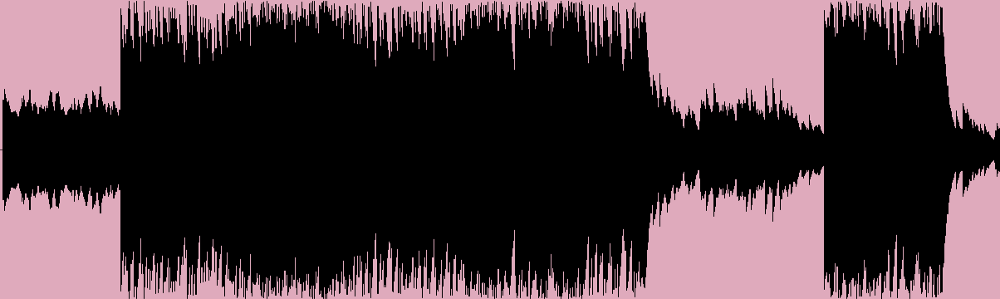
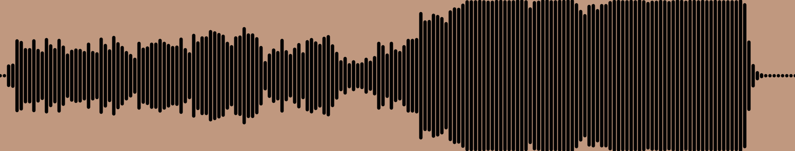

# Waveform-Generator
Takes in .wav audio and generates a waveform from it. You can change the color of the background and waveform, the length of the image, and the thickness of the bars and space between them

# Example Images
#### IGOR'S THEME | Tyler, the Creator (Thickness 1, Spacing 0)

#### Happier Than Ever | Billie Eilish (Thickness 8, Spacing 2)

#### Touch | Daft Punk (Thickness 4, Spacing 3)

